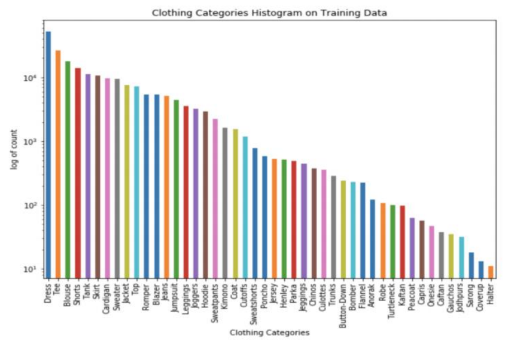
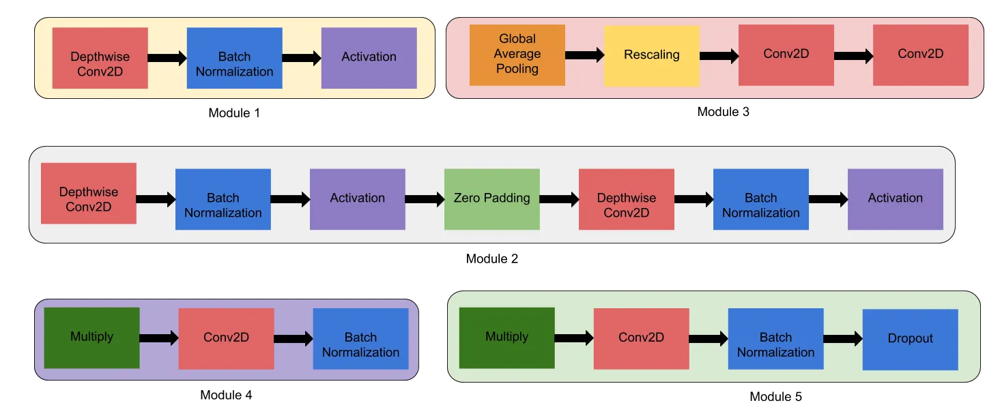
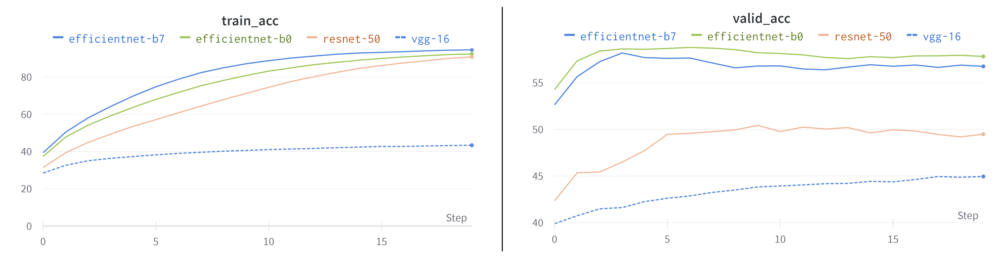
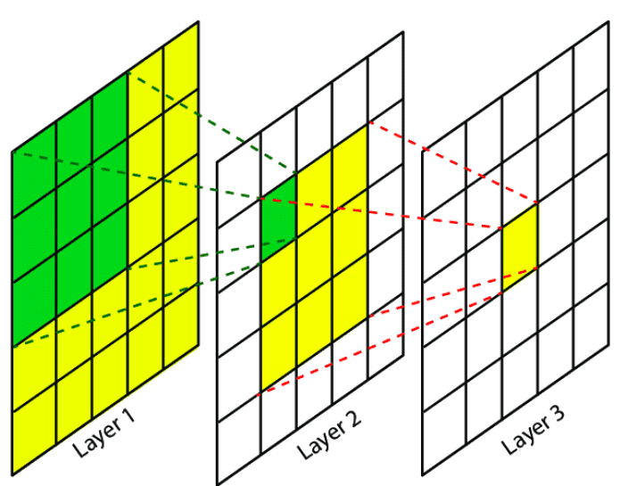
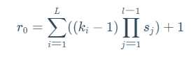
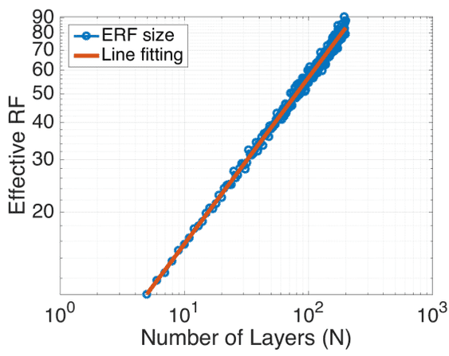

# Clothing Articles Classification

Repo containing the training of a classifier for clothing articles

# Introduction 
Online shopping for fashion items is a complex multi-step process. Part of the problem lies 
in incorrect annotations associated with a particular item like mismatches in style, fabric quality, 
color, etc. This problem can be solved by automating detailed attribute annotation and categorization of clothing items with high accuracy. 
I propose to build a classifier using dataset called [DeepFasion](http://mmlab.ie.cuhk.edu.hk/projects/DeepFashion.html) which has over 289,222 images with rich attributes, landmark and category annotation.

# Dataset Summary:
I used the [DeepFasion](http://mmlab.ie.cuhk.edu.hk/projects/DeepFashion.html) Dataset which is a large-scale clothes database for Clothing Category and Attribute Prediction, collected by the Multimedia Lab at the Chinese University of Hong Kong.

The classification benchmark was published in 2016. It evaluates the performance of the FashionNet Model in predicting 46 categories and 1000 clothes attributes. For the original paper please refer to [DeepFashion: Powering Robust Clothes Recognition and Retrieval with Rich Annotations, CVPR 2016](https://www.cv-foundation.org/openaccess/content_cvpr_2016/papers/Liu_DeepFashion_Powering_Robust_CVPR_2016_paper.pdf).

The DeepFashion Database contains several datasets. In this project, the Category and Attribute Prediction Benchmark was used. This dataset contains 289,222 diverse clothes images from 46 different categories.

Below is the histogram of the clothing 46 categories :


## Note
I have filtered out some of the classes with minimum images (roughly smalled than 1000 images) and ended up with 22 class and 22000 total number of images and that is because the lack of hardware resources to train and conduct multiple experiments on the full dataset.

# Modeling Overview:
This section gives the details of the results of my experiments with `VGG-16`, `ResNet-50`, `Efficientnet-B0`, and `Efficientnet-B7`. I used the mentioned backbones freezed and also finetuned its weights with the classification head.
## Overview of the backbones:
**`VGG-16`**

VGG is a commonly used neural network because it performs well, it was trained for weeks on a massive set of training data, it generalizes well to different use cases, It consists of 16 convolutional layers.


------------------------------------

**`ResNet-50`**

The ResNet-50 model used for this experiment consists of 48 convolutional layers, as well as a MaxPool and an Average Pool layer (48+1+1=50 layers). With the deeper network structure, better detection rates are achieved indeed than with the flatter network structures previously used.s.


------------------------------------

**`EfficientNet-B0 and EfficientNet-B7`**

EfficientNet is a mobile friendly pure convolutional model (ConvNet) that proposes a new scaling method that uniformly scales all dimensions of depth/width/resolution using a simple yet highly effective compound coefficient.


With considerably fewer numbers of parameters, the family of models are efficient and also provide better results. 
The total number of layers in EfficientNet-B0 the total is 237 and in EfficientNet-B7 the total comes out to 813!! But don’t worry all these layers can be made from 5 modules shown below.



------------------------------------

# Installation

To use this project, first clone the repo on your device using the command below:

Clone the repo

```
https://github.com/omarsayed7/deepfashion_classification.git
```

Create new conda environment containing the dependencies in the [requirements file](requirements.yml) .

Using `mamba` is preferred it's faster and more stable. see [here](https://mamba.readthedocs.io/en/latest/installation.html#existing-conda-install) for installation steps.

```
#If using mamba
mamba env create -f requirements.yml

#If using conda
conda env create -f requirements.yml
```
Activate the created environment.

```
conda activate fashion_classification
```
If you are using only `pip` 

```
pip install -r requirements.txt
```
# Project Structure:
```
├── README.md
├── .gitignore
├── requirements.yml
├── requirements.txt
├── data
|   └── classification_data
|       │── fashion_data.csv
|       │── mapping.json
|       │── img
|       └── raw_annotations
├── models
|   |── efficientnet-b0_0.0001_True_64_categorical_crossentropy_0.5_10_V1
|   |    │── accuracy.png
|   |    │── args.json
|   |    │── best_model.pth
|   |    │── quantized_best_model.pth
|   |    │── final_model__2023-05-20.pth
|   |    │── loss.png
|   |    └── top_losses.csv
|   └── logging
|       └── experiments_logs.csv
├── src
|    ├── model
|    │   │── inference
|    |   |   └── eval.py
|    |   | 
|    │   │── performance_measurement
|    |   |   │── calculate_flops.py
|    |   |   └── calculate_receptive_field.py
|    │   └── training
|    |   |   │── main.py
|    |   |   │── data_utils.py
|    |   |   │── dataset.py
|    |   |   │── evaluation_utils.py
|    |   |   │── models.py
|    |   |   └── training_utils.py
|    ├── data
         └── build_dataset.py
```
# How to use:
**1-Setup the directories to match the above file structure and create the training logs csv file**
```
cd src/model/training
python main.py -script_mode setup
```
**2-Download the zip file of the [images](https://drive.google.com/drive/folders/0B7EVK8r0v71pekpRNUlMS3Z5cUk?resourcekey=0-GHiFnJuDTvzzGuTj6lE6og) and place it inside `/data` directory**

**3-Unzip the images inside `/data/classification_data`**

**4-Download the [`list_category_img.txt`](https://drive.google.com/drive/folders/0B7EVK8r0v71pWWxJeGVqMjRkUVE?resourcekey=0-sICGfjSkFn6dLpFAwLx8pw) from the raw dataset and place it inside `/data/classification_data/raw_annotations`**

**5- Build the dataset from raw annotations to a CSV file will be used in training and a mapping json file to map label_id to label_str**
```s
cd src/data
python build_dataset.py -sampling_threshold 1000 -maximum_num_images 1000
```
```
--sampling_threshold        Threshold for filtering out the minor classes
--maximum_num_images        max num of images per class
```
**Now you are ready for training!**

------------------------------

## Training Results:

Idealy you can run the following script in order to conduct a training experiment 

```Shell
cd src/model/training
python main.py -script_mode train -epochs 20 -model_name resnet-50 -use_wandb True -freeze_backbone True -experiment_version 1
```
```
--experiment_version        Version of experiment.
--epochs                    Number of train epochs.
--learning_rate             Learning rate of the optimizer.
--lr_scheduler              Use learning rate scheduler or not.
--batch_size                Batch size.
--loss                      training loss function. 
--dropout                   dropout of the classification head, or put None if you do not need dropout.
--model_name                Backbone name ("vgg-16", "resnet-50", "efficientnet-b0", "efficientnet-b7").
--freeze_backbone           Either freezing the backbone layers or not.
--use_wandb                 Track the experiments with Weights and Biases.
--eval_mode                 Evaluation and exporting the classification report on any of a subset of data (train, valid, or test).
--calculate_top_losses      Either Calculating top losses of the training data or not.
--script_mode               train mode or setup the data and folder structure mode.
```
**Note**

We held the data loading and tranformation, training hyperparameters fixed for fair comparison between the proposed backbones. 

**Data Loadining** 

* Train data: `16460`, Validation data: `2680`, Test data: `2680`
* Image size `(256,256,3)`
* Channel Normalization `(0.5, 0.5, 0.5), (0.5, 0.5, 0.5)`

**Training Hyperparameters**

*  `Batch Size` = 32

*  `Epochs` = 20

*  `optimizer` = Adam

*  `lr` = 0.001

*  `cls_head_dropout` = 0.5

*  `loss` = categorical_crossentropy

**Training Modifications**
* **Saving Best model while training:** Measuring validation accuracy for each epoch and save the model from the best validation epoch
* **Learning Rate Scheduler:** To improve the convergence and stability of deep learning models
* **Gradient Scaling:** scaling our gradients by some factor, so they aren't flushed to zero. 
* **Garbage Collection:** To free up memory and cache
* **Track experiments using Weights and Biases:** W&B Python Library to track machine learning experiments with a few lines of code. and also we can review the results in an interactive dashboard

**Experiments Results**

All the training experiments held on a free [Colab](https://colab.research.google.com/) instances mounted with Nvidia Tesla T4 GPU. I didn't explore more sets of hyperparameters due to the limited time and resources.


Fig. Training and validation curves for the different classifiers. EfficientNet-B0 achieves better result.


~  | VGG16 | EfficientNet-B0 | EfficientNet-B7 | ResNet-50
--- | --- | --- | --- | ---
Total Param. |135.3 M | **4.3 M** | 46.4 M | 24 M
Trainable Param. |135.3 M | **4.3 M**| 46.4 M| 24 M
Val. Accuracy | 46%| **60%**|59%| 53%
Val. Macro-F1 | 45%| **59%**|59%| 53%
Estimated FLOPS (Tesla T4) | 0.07 s |**0.002 s** |0.03 s| 0.02 s
FLOPs | 20.23 G |**0.53G** | 6.93 G | 5.41 G
Estimcated MACCs | 40.46 G |**1.06 G** |13.86 G| 10.82 G
Overall receptive field | 212 × 212 |299 × 299 |299 × 299| 96 × 96

Table. Comparison model sizes, validation accuracy. validation macro f1-score, estimated FLOPS, FLOPs, estimated MACCs, and the overall receptive filed of the different classifiers backbones. We select all the models
trained on 20 epochs for fair comparison.

***Experiments Conculsion***

* Transfer Learning from ImageNet weights: freezing the backbone and training only the classification head led to poor in the perfromance of the results on the training and also the validation data.
* VGG-16, ResNet-50 training was very slow, compared to the variations of EfficientNet-BO/B7.
* Increasing the dropout of the classification head to `0.5` led to decreasing the effect of overfitting.
* Using Data augmentation on the training data such (`RandomCrop`, `RandomHorizontalFlip`, `RandomHorizontalFlip`, and `RandomVerticalFlip`) didn't leed to better results, but overall decreases the overfitting.
* We may use the training top losses to check the quality of the data annotations.
* The category annotations only not suitble to build a powerful classifier for clothing articles.
* Use [Grad-CAM](https://github.com/omarsayed7/Grad-CAM) for interpreting the classifier and see how the model relate the input to the predicted class.

# Model Selection:
My own criteria for selecting the best model from the previous experiments is based on a very important metric for any multi-class classification problem and it is `F1-Score`. Also keeping on my mind the deployment factors such as (model size and capacity, FLOPS, FLOPs). **`EfficientNet-B0`** achieves a good results among the validation macro f1-score, latency, and the model capacity, and I believe that EfficientNet-B0 gives the best convergence, results due to the small amount of parameters that is only need to 20 epochs only, maybe the other architectures needs more epochs to converge and perfrom better due to the bigger the number of model parameters.

## EfficientNet-B0 evaluation on the test set
The selected model performs on the test data pretty same as on the validation data and got `Macro-F1 score = 60%`, and that is a good indication of generalizing the selected model.

Also, using the following script you can evaluate any model on any target annotated dataset

```Shell
cd src/model/inference
python eval.py -weights_path models/exp/weights.pth -model_name efficientnet-b0 -eval_data_dir  ../../../data/eval_dataset -main_data_dir ../../../data/
```
```
--weights_path              Path to the weights of the model.
--model_name                Model name.
--eval_data_dir             Path to the evaluation data.
--main_data_dir             Path to the main data directory of the project.
```

## Reporting the Overall Receptive field of EfficientNet-B0

Receptive Field (RF) is defined as the size of the region in the input that produces the feature. Basically, it is a measure of association of an output feature (of any layer) to the input region. Measuring the Overall receptive field depends only on the convolutional parameters of kernels and strides and follows the following equation: 


Where r denotaed the overall RF of the architecture.

Ideally you can run the following script in order to get the overall receptive field of the architecure

```Shell
cd src/model/performance_measurement
python calculate_receptive_field.py --model_name
```

**For `EfficientNet-B0` the overall RF is `299x299` for an input size of `256x256`.**

--------
### Additional info: How can we increase the overall receptive field:
--------

There are ways and tricks to increase the RF, that can be summarized as follows:
* Add more convolutional layers (make the network deeper).

The size of the receptive field can be gradually increased by including more convolutional layers. The receptive field is increased by the kernel size for each layer with a stride of 1.

*Increasing the number of layers increases the receptive field, taken from Luo et al.*

* Increasing the kernel size.

Kernels with a large size can be helpful for incorporating information with large receptive fields,

To explain what I mean: a kernel of size 3x3 can “see” (has a receptive field of) a 9 pixel square. By contrast, a 5x5 kernel size has a receptive field of 25 pixels in a square. This means that during each dot product, the kernel will be able to incorporate more information. So bigger kernel sizes=better, right?

As it turns out, you can get the same receptive field size by stacking two 3x3 layers. Ignoring computational benefits (although they're quite large, since too many parameters can lead to overfitting), if you have two stacked layers, you can insert nonlinearities between them, which increases the representational power of the network and subsequently, leads to an accuracy increase.

* Add pooling layers.

Max pooling and average pooling are two types of 2D pooling layers that lower the spatial dimensions while expanding the receptive field. Pooling layers aid in capturing larger context and reducing geographical information by downsampling the input.

* Use Depth-wise convolutions.

Depthwise convolution is the channel-wise spatial convolution. However, note that depth-wise convolutions do not directly increase the receptive field. But since we use fewer parameters with more compact computations, we can add more layers. Thus, with roughly the same number of parameters, we can get a bigger receptive field.

* Use Dilated convolutions.

Dilations introduce “holes” in a convolutional kernel. The “holes” basically define a spacing between the values of the kernel. So, while the number of weights in the kernel is unchanged.

The receptive field grows exponentially while the number of parameters grows linearly. In other words, a 3x3 kernel with a dilation rate of 2 will have the same receptive field as a 5x5 kernel, while only using 9 parameters. Similarly, a 3x3 kernel with a dilation rate of 4 will have the same receptive field as a 9x9 kernel without dilation.

-------

### Additional info: How can we decrease the overall receptive field:
----

You can reduce the kernel size if your assignment calls for concentration on smaller details or regional patterns. For instance, substituting 1x1 or 2x2 kernels for 3x3 convolutional layers reduces the receptive field, allowing the network to focus on more focused areas of the input.


It's crucial to remember that configuring the receptive field requires careful consideration of your task's requirements and the trade-off between catching local information and overall context. Finding the ideal receptive field size for your application frequently requires testing and fine-tuning.

------------
## Measuring the Performance of the **EfficientNet-b0** model:
------------
In order to understand how to optimize a Neural Network, we must have a metric. That metric will be the inference time. In order to measure this time, we must understand 3 ideas: FLOPs, FLOPS, and MACs.

* FLOPs 

    To measure inference time for a model, we can calculate the total number of computations the model will have to perform.
    This is where we mention the term FLOP, or Floating Point Operation.
    This could be an addition, subtraction, division, multiplication, or any other operation that involves a floating point value.
    The FLOPs will give us the complexity of our model.

    * Calculating the FLOPs of **EfficientNet-B0**
        
        Run the following script
        ```Shell
        cd src/model/performance_measurement
        python calculate_flops.py --model_name efficientnet-b0
        ```
        The script will output every FLOPs per layer and the overall FLOPs of the architecture as follows:
        ```
        Operation                            OPS        
        -----------------------------------  ---------
        model_features_0_0                   14155776
        model_features_0_1                   1048576
        model_features_1_0_block_0_0         4718592
        model_features_1_0_block_0_1         1048576
        model_feature
        .
        .
        .
        mul_15                               147456
        model_features_7_0_block_3_0         23592960
        model_features_7_0_block_3_1         40960      
        model_features_8_0                   26214400
        model_features_8_1                   163840
        model_avgpool                        81920
        model_classifier_1                   327936
        fc2                                  5654
        ----------------------------------   --------
        Input size: (1, 3, 256, 256)
        529,669,522 FLOPs or approx. 0.53 GFLOPs
        ```

        **So, the overall FLOPs of EfficientNet-B0 is 0.53 GFLOPs**

* MACCs
    The final thing to consider is the MACs, standing for Multiply-Accumulate Computations.
    A MAC is an operation that does an addition and a multiplication, so 2 operations.
    In a neural network, addition and multiplications happen every time.

    Layeroutput​=W1​∗A1​+W2​∗A2​+...+Wn​∗An

    As a rule, we consider `1 MAC = 2 FLOPs`.

    **So, the overall MACCs of EfficientNet-B0 is 1.06 G**


* FLOPS 
    The second thing is the FLOPS, with a capital S.
    FLOPS are the Floating Point Operations per Second. This is a rate that tells us how good is our hardware.
    The more operations per second we can do, the faster the inference will be.

    So, we conduct the experiments on Tesla T4 GPU and it has max GFLOPS of `253.38`, 
    The inference time will be FLOPs/FLOPS = (0.53)/(253.38) = 0.002 s or 2ms. 

-----
### Additional info: What are the most computationally expensive layers in EfficientNet-B0?:
-----
Based on the following equations of how we calculate the FLOPs of a convolution layer, and a fully connected layer

Convolutions FLOPs = 2x Number of Kernel x Kernel Shape x Output Shape

Fully Connected Layers FLOPs = 2x Input Size x Output Size

The most computationaly expensive layers in any CNN-based models are the CNN layer and the Full connected layers.

For the **EfficientNet-B0** the most computationally expensive layers are the first CNN layer of every block of the 7 blocks of the model.

-----
### Additional info: How can we decrease FLOPs and MACCs?
-----
When we reduce the number of operations, we are replacing some operations with others that are more efficient. To decrease FLOPS and MACCs per layer, one can consider the following strategies:

* Applying model optimization techniques:

    The complexity of the computation can be reduced by reducing the amount of parameters in the network using strategies like weight sharing, quantization, and pruning. For instance, pruning strategies eliminate useless connections or neurons, which lowers FLOPS and MACCs.

* Decrasing the floating point of the weights:

    Lower precision choices like 16-bit floating-point or even fixed-point arithmetic can be utilised in place of higher precision floating-point operations (like 32-bit floating-point). Due to the decrease in computations needed for each operation, FLOPS and MACCs are also decreased.

* Reducing the input size:

    The quantity of operations needed in each layer reduces as the spatial dimensions of the input increase. This can be accomplished using strategies like pooling and downsampling. For instance, pooling layers with bigger strides or employing strided convolutions can minimise the spatial dimensions, which in turn reduces FLOPS and MACCs.

* Specific solution: Using Separable Convolutions:

    Pooling is great, but when calculating the number of FLOPs, it's still expensive. A separable convolution is a convolutional layer that divides the standard convolutional layer into two layers: a depthwise convolution and a pointwise convolution.
    
    A depthwise convolution is a normal convolution, but we don't change the depth. We're therefore reducing the number of FLOPs.


In conclusion, lowering network depth or width, employing lower precision, using model optimisation approaches, and using specialised hardware are some methods for reducing FLOPS and MACCs per layer. These techniques can be carefully considered in order to lessen computing complexity and improve network effectiveness.

-----------------

# Future Work:
* Check the quality of the full dataset.
* Train the model with the full dataset, and also use any sampling of data augmentation techniques to increase the images of the minor classes.
* Conduct many experiments with different sets of hyperparameters to get better results specially increase the number of training epochs to converge on a such big dataset like DeepFashion.
* If we want to use the classifier model on an edge device or web server, we have to optimize the model like use dynamic quantization and exporting the model to ONNX.


# Reference

[Fashion clothing category classification Shewta et. al.](https://cs230.stanford.edu/projects_fall_2018/reports/12449289.pdf)

[DeepFashion dataset page](https://mmlab.ie.cuhk.edu.hk/projects/DeepFashion.html)

[Optimize Deep Learning models](https://www.thinkautonomous.ai/blog/deep-learning-optimization/)

[Receptive Field Refinment Mats. et. al](https://arxiv.org/pdf/2211.14487.pdf)

[Tesla T4 HPC Performance Benchmarks](https://www.microway.com/hpc-tech-tips/nvidia-turing-tesla-t4-hpc-performance-benchmarks/)

[EfficientNet: Rethinking Model Scaling for Convolutional Neural Networks](https://arxiv.org/abs/1905.11946)

[Deep Residual Learning for Image Recognition](https://arxiv.org/abs/1512.03385)

[Very Deep Convolutional Networks for Large-Scale Image Recognition](https://arxiv.org/abs/1409.1556)

[pytorch-estimate-flops](https://github.com/1adrianb/pytorch-estimate-flops)

[Weights & Biases](https://wandb.ai/)

[PyTorch Deep Learning framework](https://pytorch.org/)
